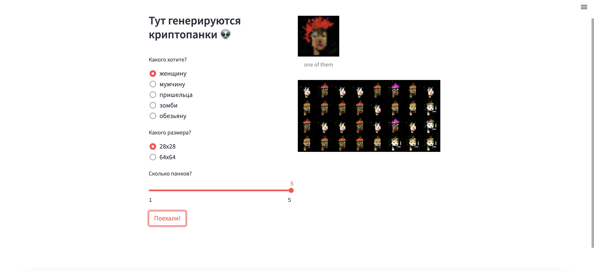

# CryptoPunks
Conditional GAN, обученная для генерации криптопанков

[Идея не новая](https://medium.com/mlearning-ai/generate-nft-cryptopunks-with-deep-convolutional-generative-adversarial-network-dcgan-db35f0a1adb4),
оригинальный датасет [взят отсюда](https://www.kaggle.com/datasets/tunguz/cryptopunks/)

<h3>Описание файлов</h3>

- put_punks_to folders.ipynb - сортировка оригинального датасета по папкам

- Cryptopunks GAN 24x24.ipynb - colab блокнот для тренировки сети для размера изображения 24x24
